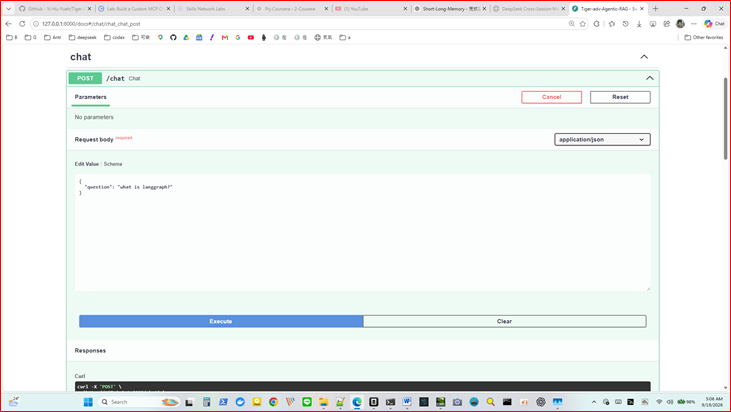
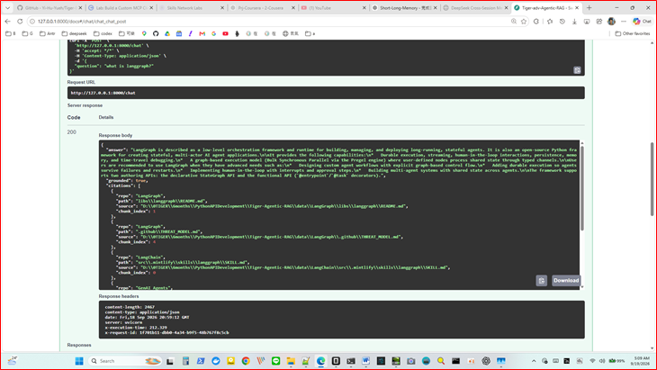

# Tiger-adv-Agentic-RAG-opencode（自建版）

Enterprise Agentic-RAG：FastAPI + 自製 GraphWorkflow + Ollama + Native Qdrant Server + BGE Reranker + Streamlit。

> 本目錄版本為從零自建，未複製旁邊任何完整專案程式；直接沿用 `data/qdrant-server` 現有向量庫。

> 用chatgpt製作的專案，並以此專案的架構文件、操作手冊、與readme，餵給opencode，叫opencode從新實作專案，花費0元。


## 測試
- "question": "what is langgraph?"

- AI
'''
LangGraph is described as a low-level orchestration framework and runtime for building, managing, and deploying long-running, stateful agents. It is also an open-source Python framework for creating stateful, multi-actor AI agent applications.\n\nIt provides the following capabilities:\n*   Durable execution, streaming, human-in-the-loop interactions, persistence, memory, and time-travel debugging.\n*   A graph-based execution model (Bulk Synchronous Parallel via the Pregel engine) where user-defined nodes process shared state through typed channels.\n\nUsers are recommended to use LangGraph when they have advanced needs such as:\n*   Designing custom agent workflows with explicit graph-based control flow.\n*   Adding durable execution so agents survive failures and restarts.\n*   Implementing human-in-the-loop with interrupts and approval steps.\n*   Building multi-agent systems with shared state across agents.\n\nThe framework supports two authoring APIs: the declarative StateGraph API and the functional API
'''


## Features

- ✅ Retrieval（Multi-Query，最多2，原query優先）
- ✅ Qdrant Vector Search（`enterprise_rag`，top_k=5，hnsw_ef=32）
- ✅ BGE Reranker（`BAAI/bge-reranker-base`，lazy載入+fallback）
- ✅ Document Grader（LLM yes/no）
- ✅ Query Rewrite（含重試，上限2）
- ✅ Answer Generator（DATA ONLY，找不到回 `I don't know.`）
- ✅ Hallucination Checker + Citation Generator
- ✅ GraphWorkflow 狀態機 + Reflection + Memory（window=5）
- ✅ Multi-Agent（retrieve後執行：researcher/writer/reviewer/verifier）
- ✅ LangGraph adapter（experimental，非主路徑）
- ✅ FastAPI：`/health`、`/chat`、`/chat/batch`、`/chat/stream`、`/evaluation/run`、`/evaluation/dashboard`、Swagger
- ✅ Streamlit Frontend + Evaluation console
- ✅ 完整 pytest：unit / integration / e2e

## Architecture

```text
User / Frontend / Swagger
        │
        ▼
FastAPI :8000
        │
        ▼
GraphWorkflow（主路徑，非LangGraph StateGraph）
  Query Generator → Retriever → BGE Rerank → Grader
  → Rewrite/Retry → Generate → Hallucination Check
  → Reflect → Citations → Response
        │                    ▲
        ▼                    │
 Qdrant :6333        Ollama :11434
 (enterprise_rag)    (gemma4:e4b + bge-m3)
```

## Project Structure

```text
Tiger-adv-Agentic-RAG-opencode
├── app.py
├── api/
│   ├── schemas.py
│   ├── dependencies.py
│   └── routes/health.py  chat.py  evaluation.py
├── core/
│   ├── config.py  qdrant_factory.py  bootstrap.py
│   ├── agents/agents.py  multi_agent.py
│   ├── graph/state.py  router.py  nodes.py  workflow.py
│   ├── langgraph/workflow.py  tools.py
│   ├── prompts/templates.py
│   ├── providers/ollama_chat.py  ollama_embedder.py
│   │            bge_reranker.py  qdrant_retriever.py
│   ├── retrievers/retriever_pipeline.py
│   └── utils/memory.py  metrics.py  tools.py
├── frontend/Home.py  pages/evaluation.py
├── evaluation/history/  reports/
├── config/qdrant-native.yaml
├── scripts/start_qdrant_native.ps1  stop_qdrant_native.ps1
│        migrate_qdrant_server_to_server.py
├── runtime/qdrant/qdrant.exe（官方release下載，不進Git）
├── data/qdrant-server/（現有向量庫，不進Git）
├── tests/unit/  integration/  e2e/
├── requirements.txt  pytest.ini  start.py
└── Tiger-adv-Agentic-RAG-opencode_*.docx（原始文件）
```

## Requirements

- Windows 11 + Python 3.11.3（`.venv`）
- Ollama：`gemma4:e4b`、`bge-m3`
- Native Qdrant Server 1.18.2（`runtime/qdrant/qdrant.exe`）
- 現有向量庫：`data/qdrant-server`

| Collection | Points |
| --- | ---: |
| `benchmark_crag_task_1_2_bge_m3` | 259,752 |
| `benchmark_crag_task_1_2_medium_bge_m3` | 19,416 |
| `benchmark_crag_task_1_2_smoke_bge_m3` | 2,530 |
| `enterprise_rag` | 225,336 |
| Total | 507,034 |

向量：1024維 Cosine（bge-m3）。Payload：`repo, source, relative_path, filename, extension, chunk_index, text`。

## Installation

```powershell
Set-Location "D:\0TIGER\6months\PythonAPIDevelopment\opencode-prjs\Tiger-adv-Agentic-RAG-opencode"
& "D:\python3.11.3\python.exe" -m venv .venv
& ".\.venv\Scripts\Activate.ps1"
python -m pip install -r requirements.txt
python -m pip check  # No broken requirements found.
```

Qdrant binary（已下載好；若遺失重下）：

```powershell
$QdrantZip = Join-Path $env:TEMP "qdrant-1.18.2.zip"
Invoke-WebRequest -Uri "https://github.com/qdrant/qdrant/releases/download/v1.18.2/qdrant-x86_64-pc-windows-msvc.zip" -OutFile $QdrantZip
Expand-Archive -Path $QdrantZip -DestinationPath ".\runtime\qdrant" -Force
```

Ollama：

```powershell
ollama list  # 要有 gemma4:e4b, bge-m3
ollama pull gemma4:e4b
ollama pull bge-m3
```

## Snapshot Install（Google Drive 快照還原）

向量快照：https://drive.google.com/drive/folders/116xGk8y56ij00SOSUboJmNAC7NXqmEeL

不要直接把snapshot upload到Windows Native Qdrant（實測`applied_seq.json Access denied os error 5`）。可靠流程：WSL2 :7333還原 → server-to-server搬到Windows :6333。

```powershell
# 1. 下載Drive全部檔案到
# D:\0TIGER\6months\Qdrant-Google-Backup\
#   benchmark_crag_task_1_2_bge_m3-*.snapshot
#   benchmark_crag_task_1_2_medium_bge_m3-*.snapshot
#   benchmark_crag_task_1_2_smoke_bge_m3-*.snapshot
#   enterprise_rag-*.snapshot
#   manifest.json

# 2. WSL2臨時Qdrant :7333
wsl -d Ubuntu -- bash -lc 'mkdir -p ~/qdrant-temp/bin ~/qdrant-temp/storage; cd ~/qdrant-temp/bin; curl -L -o qdrant.tar.gz "https://github.com/qdrant/qdrant/releases/download/v1.18.2/qdrant-x86_64-unknown-linux-musl.tar.gz"; tar -xzf qdrant.tar.gz; chmod +x qdrant'
wsl -d Ubuntu -- bash -lc 'nohup env QDRANT__SERVICE__HOST=0.0.0.0 QDRANT__SERVICE__HTTP_PORT=7333 QDRANT__SERVICE__GRPC_PORT=7334 QDRANT__STORAGE__STORAGE_PATH="$HOME/qdrant-temp/storage" "$HOME/qdrant-temp/bin/qdrant" > "$HOME/qdrant-temp/qdrant.log" 2>&1 & sleep 5'
Invoke-RestMethod http://127.0.0.1:7333/healthz

# 3. 還原4個snapshot到WSL
$RestoreDir = "D:\0TIGER\6months\Qdrant-Google-Backup"
$Manifest = Get-Content "$RestoreDir\manifest.json" -Raw | ConvertFrom-Json
foreach ($item in $Manifest) {
  curl.exe --fail-with-body -X POST "http://127.0.0.1:7333/collections/$($item.collection)/snapshots/upload?wait=true&priority=snapshot" -F "snapshot=@$(Join-Path $RestoreDir $item.snapshot)"
}

# 4. 搬到Windows正式庫 :6333
powershell -ExecutionPolicy Bypass -File .\scripts\start_qdrant_native.ps1
python .\scripts\migrate_qdrant_server_to_server.py --source-url http://127.0.0.1:7333 --target-url http://127.0.0.1:6333
# 4個COLLECTION皆PASS：259752 / 19416 / 2530 / 225336 = 507,034

# 5. 啟API驗證
$env:QDRANT_MODE="server"; $env:QDRANT_URL="http://127.0.0.1:6333"
python -m uvicorn app:app --host 127.0.0.1 --port 8000
Invoke-RestMethod http://127.0.0.1:8000/health
```

完成後日常只需Native Qdrant :6333 + Ollama + FastAPI，不必重做WSL還原。
## Run

```powershell
# 1. Qdrant
powershell -ExecutionPolicy Bypass -File .\scripts\start_qdrant_native.ps1
Invoke-RestMethod http://127.0.0.1:6333/healthz

# 2. FastAPI
$env:QDRANT_MODE="server"; $env:QDRANT_URL="http://127.0.0.1:6333"
python -m uvicorn app:app --host 127.0.0.1 --port 8000
# http://127.0.0.1:8000/docs

# 3. Frontend（可選）
streamlit run frontend/Home.py
```

## Manual Test

```powershell
Invoke-RestMethod http://127.0.0.1:8000/health
# status=ok workflow=ready vectorstore=connected qdrant_mode=server ollama_chat=ok ollama_embed=ok

Invoke-RestMethod -Method Post http://127.0.0.1:8000/chat `
  -ContentType "application/json" `
  -Body '{"question":"What is LangGraph and how does it support agentic workflows?"}'
# HTTP200 + answer有內容 + grounded=true + citations非空

Invoke-RestMethod -Method Post http://127.0.0.1:8000/chat/batch `
  -ContentType "application/json" `
  -Body '{"questions":["What is LangGraph?","What is LangChain?"]}'

Invoke-RestMethod -Method Post http://127.0.0.1:8000/chat/stream `
  -ContentType "application/json" `
  -Body '{"question":"What is LangGraph?"}'
# text/plain chunked（目前為完整答案分段串流，非token即時生成）

Invoke-RestMethod -Method Post "http://127.0.0.1:8000/evaluation/run?dataset_name=manual" `
  -ContentType "application/json" `
  -Body '[{"question":"What is LangGraph?","expected_answer":"orchestration framework"}]'
Invoke-RestMethod http://127.0.0.1:8000/evaluation/dashboard
```

## Tests

```powershell
python -m pytest tests/unit -q
python -m pytest tests/integration/test_services.py -q
python -m pytest tests/e2e/test_workflow.py -q
python -m pytest tests/integration/test_api.py tests/integration/test_langgraph.py tests/e2e/test_smoke.py -q
```

實測：unit 14 passed；services 4 passed；health/chat/batch/stream/LangGraph/workflow/smoke 全過。

## Ports

| Port | 服務 |
| --- | --- |
| 6333/6334 | Native Qdrant HTTP/gRPC（正式） |
| 8000 | FastAPI |
| 8501 | Streamlit |
| 11434 | Ollama |

## Notes

- 主路徑是自製 `GraphWorkflow`，`core/langgraph` 僅為adapter/實驗，不謊稱全由StateGraph驅動。
- `/health` 同查 Qdrant + Ollama chat + embedding。
- `/chat/stream` 為分段串流，非token streaming。
- `data/qdrant-server`、`runtime/qdrant/qdrant.exe`、snapshots不進Git。

## Custom Data Import（匯入自己的資料）

程式：`scripts/build_index.py`（掃描 → 切分 → Ollama bge-m3向量化 → Qdrant upsert → count驗證）。
支援：`.md/.mdx/.txt/.py/.ipynb/.json/.yaml/.yml`。Payload定約：`repo, source, relative_path, filename, extension, chunk_index, text`。

```powershell
# Qdrant須先啟動
powershell -ExecutionPolicy Bypass -File .\scripts\start_qdrant_native.ps1

# 1. 準備文件，放到例如 data/my_docs/

# 2. 匯入新collection（不存在會自動建立1024維Cosine）
python scripts/build_index.py --source data/my_docs --collection my_docs --repo my_docs
# 成功顯示：COLLECTION: my_docs POINTS=<N> CHUNKS_ADDED=<N> STATUS: PASS

# 3. 追加到現有collection
python scripts/build_index.py --source data/my_docs --collection enterprise_rag --repo my_docs --append

# 4. 打掉重建
python scripts/build_index.py --source data/my_docs --collection my_docs --repo my_docs --recreate

# 5. 切換API使用新庫
$env:QDRANT_COLLECTION="my_docs"
$env:QDRANT_MODE="server"; $env:QDRANT_URL="http://127.0.0.1:6333"
python -m uvicorn app:app --host 127.0.0.1 --port 8000
# /chat 問新文件內容，citations出現新repo/path即成功
```

參數：`--batch-size`（預設64）、`--chunk-size`（預設1000）、`--chunk-overlap`（預設200）。
`data/sample_docs/`內有兩個可直接試跑的範例。

MIT License.


